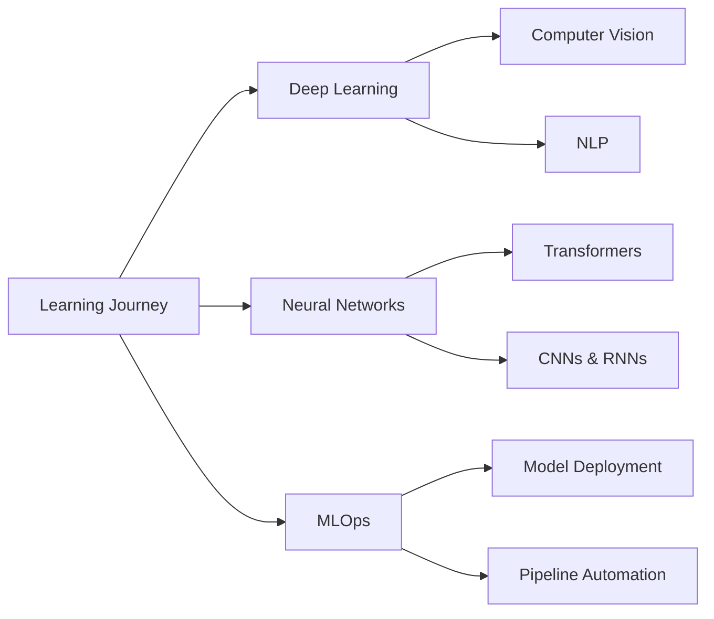

<div align="center">
  
# 👋 Hi, I'm Jay Lao

### 🤖 Machine Learning Engineer | Deep Learning Enthusiast | Data Scientist

*Transforming data into intelligent solutions*

[](https://github.com/yourusername)
[](https://github.com/yourusername)

</div>

---

## 🚀 About Me

I'm a passionate **Machine Learning Engineer** specializing in building intelligent systems with Python and cutting-edge ML/DL frameworks. I believe in the power of data to solve real-world problems and am constantly exploring new frontiers in artificial intelligence.

```python
class JayLao:
    def __init__(self):
        self.role = "ML/DL Engineer"
        self.language_spoken = ["en_US", "Python", "SQL"]
        self.current_focus = "Deep Learning & Neural Networks"
        self.learning = "Advanced ML Architectures"
        
    def say_hi(self):
        print("Thanks for stopping by! Let's build something amazing together.")

me = JayLao()
me.say_hi()
```

---

## 🛠️ Tech Stack

### **Languages**


### **ML/DL Frameworks & Libraries**


### **Tools & Technologies**


### **Data Visualization**


---

## 📊 GitHub Stats

<div align="center">
  


</div>

---

## 🎯 Current Focus



### 📚 Learning Path

- 🧠 **Deep Learning Architectures** - Advanced neural network designs
- 🔬 **Experiment Tracking** - MLflow, Weights & Biases
- ☁️ **Cloud ML** - AWS SageMaker, Google Cloud AI Platform
- 🚀 **Model Deployment** - FastAPI, Flask, Docker, Kubernetes
- 📊 **Feature Engineering** - Advanced techniques for model improvement

---

## 💡 What I'm Working On

- 🔭 Building end-to-end ML pipelines
- 🌱 Exploring state-of-the-art deep learning research
- 👯 Open to collaborating on AI/ML projects
- 💬 Ask me about Python, Machine Learning, and Deep Learning
- ⚡ Fun fact: I debug with print statements more than I'd like to admit!

---

## 📈 Coding Activity

<!--START_SECTION:waka-->
<!--END_SECTION:waka-->

---

## 🏆 Achievements

<div align="center">


</div>

---

## 📫 Let's Connect

<div align="center">

[](https://linkedin.com/in/yourprofile)
[](https://twitter.com/yourhandle)
[](mailto:your.email@example.com)
[](https://yourportfolio.com)

</div>

---

<div align="center">

### 💭 Random Dev Quote


### 📊 Profile Views


---

**⭐️ From [Jay Lao](https://github.com/yourusername)**

*"The best way to predict the future is to create it."*

</div>
